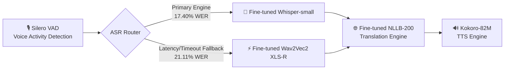

# 🏔️ Balti Tarjuman (بلتی ترجمان)

[](https://huggingface.co/YuvrajGujari/whisper-small-balti)
[](LICENSE)
[](https://www.python.org/)

An end-to-end Speech-to-Speech Translation (S2ST) system for **Balti (بلتی)**, a low-resource Tibetic language spoken by ~400,000 people across Gilgit-Baltistan and Baltistan, written in Perso-Arabic (Nastaliq) script.

Balti remains severely under-resourced in NLP and speech technology, with limited publicly available datasets, models, and language-specific tooling. **Balti Tarjuman** bridges this gap by deploying an integrated pipeline that translates spoken Balti into synthesized English speech — available both as a **batch pipeline** and as a **real-time streaming pipeline** (~2–3s round-trip latency from live microphone input).

---

## 🎥 Demo

**Upload a Balti audio file and hear the English translation:**


**Live, unscripted — speaking Balti into the mic:**


🎬 [Watch the full demo with audio (1:04)](https://github.com/user-attachments/assets/ffed7c0f-b8a0-4312-b6d5-eccdb7e58e85)

---

## 🏗️ System Architecture & Failover Design

The pipeline processes continuous audio through four sequential stages with integrated **circuit-breaker resilience**:



1. **Voice Activity Detection (VAD):** [Silero VAD](https://github.com/snakers4/silero-vad) isolates valid speech frames, drops silent segments, and handles dynamic noise floor trimming.

2. **Resilient ASR Engine (Whisper + Wav2Vec2 Fallback):**

   * **Primary Engine:** Fine-tuned [`openai/whisper-small`](https://huggingface.co/YuvrajGujari/whisper-small-balti) (**17.40% WER**) transcribes Balti speech into Perso-Arabic (Nastaliq) text.
   * **Fallback Circuit Breaker:** If Whisper exceeds processing latency bounds or encounters decoder stalls on noisy live inputs, the system gracefully route-fails to an encoder-only CTC model—fine-tuned [`wav2vec2-xls-r-300m`](https://huggingface.co/YuvrajGujari/wav2vec2-balti-specaugment) (**21.11% WER**). This non-autoregressive pass provides more predictable execution times and helps prevent dropped frames during live streaming.

3. **Machine Translation (MT):** Fine-tuned [`facebook/nllb-200-distilled-600M`](https://huggingface.co/YuvrajGujari/nllb-balti-mt) converts translated Perso-Arabic Balti text into target English syntax.

4. **Text-to-Speech (TTS):** [Kokoro-82M](https://huggingface.co/hexgrad/Kokoro-82M) synthesizes high-quality English audio from the translated text.

---

### Pipeline Execution Modes

The unified pipeline operates in two modes sharing a single model lifecycle:

* **Batch Mode** (`pipeline.py`) — Processes standard `.wav` files via `BaltiTarjumanPipeline.run()` for full offline translations.
* **Streaming Mode** (`streaming_pipeline.py`) — Real-time audio streaming built on top of Silero's `VADIterator` coupled with an asynchronous, multi-threaded worker/queue pipeline. Captures, infers, and outputs translated speech with low round-trip latency (~2–3s) without locking system audio buffers or duplicating GPU memory overhead.

### Streaming Latency

The current streaming pipeline achieves approximately **2–3 seconds of round-trip latency** from live microphone input.

Measured on a **Kaggle T4 GPU** through a live microphone input using the Gradio interface. The measurement is based on informal repeated testing across multiple utterances and is **not intended as a controlled multi-run latency benchmark**.

---

## 📊 Evaluation

All ASR experiments in this repository use the project's held-out validation set and the same WER evaluation pipeline unless otherwise specified.

Results should be compared with external baselines only when their dataset split and evaluation methodology are known to be compatible. The BaltiVoice comparison shown below has **not been independently verified as an identical evaluation setup**, so the published result is included as an external reference point rather than a directly controlled comparison.

For machine translation, BLEU is reported on the available Balti-English evaluation data.

---

## 🏆 ASR Results — Balti Tarjuman

Our fine-tuned Whisper-small model currently achieves the **best WER observed in this project**, improving substantially over the published BaltiVoice Whisper-small baseline of **26.74%**.

Results below were obtained across experiments conducted in this project. The published BaltiVoice result is included as an external reference point.

|   Rank   | Model Architecture            | Strategy                         |   Steps  | Validation WER |                                    Link                                    |
| :------: | :---------------------------- | :------------------------------- | :------: | :------------: | :------------------------------------------------------------------------: |
| 🥇 **1** | **Whisper-small (Champion)**  | **Cold-Start + SpecAugment**     | **2500** |   **17.40%**   |     [HF Model](https://huggingface.co/YuvrajGujari/whisper-small-balti)    |
| 🥈 **2** | Wav2Vec2 XLS-R 300M           | SpecAugment + Tuned LR           |   7560   |   **21.11%**   | [HF Model](https://huggingface.co/YuvrajGujari/wav2vec2-balti-specaugment) |
| 🥉 **3** | *BaltiVoice Paper Baseline*   | Published Literature             |     —    |    *26.74%*    |                                      —                                     |
|     4    | Wav2Vec2 XLS-R 300M           | Cold-Start CTC (no augmentation) |   7400   |   **22.82%**   |       [HF Model](https://huggingface.co/YuvrajGujari/wav2vec2-balti)       |
|     5    | Whisper-small (Warm-Start R2) | Standard Fine-Tuning (`1e-5` LR) |   1000   |   **36.38%**   |                                      —                                     |
|     6    | Whisper-small (Zero-Shot)     | Base Out-of-the-Box              |     0    |   **63.42%**   |                                      —                                     |

---

## 🌐 Machine Translation

The translation stage uses a fine-tuned **NLLB-200 distilled 600M** model adapted for Balti.

### Model

* **Base:** `facebook/nllb-200-distilled-600M`
* **Balti configuration:** `bft_Arab`
* **Training data:** 504 Balti-English parallel pairs from the available public Balti-English data used in this project
* **Evaluation metric:** BLEU
* **BLEU:** **4.88**

NLLB-200 did not natively provide Balti support for the required configuration, so the translation stage required model adaptation before fine-tuning. The project introduced the `bft_Arab` language token and initialized its embedding from a related existing language representation rather than leaving the new embedding randomly initialized.

The resulting model is integrated directly into the end-to-end Balti → English pipeline.

---

## 🔗 Models & Datasets

| Component           | Repository Link                                                                                             | Description                                                             |
| :------------------ | :---------------------------------------------------------------------------------------------------------- | :---------------------------------------------------------------------- |
| 🏆 **ASR Champion** | [`YuvrajGujari/whisper-small-balti`](https://huggingface.co/YuvrajGujari/whisper-small-balti)               | Fine-tuned Whisper-small (**17.40% WER**)                               |
| ⚡ **ASR Backup**    | [`YuvrajGujari/wav2vec2-balti-specaugment`](https://huggingface.co/YuvrajGujari/wav2vec2-balti-specaugment) | Fine-tuned Wav2Vec2 XLS-R 300M, SpecAugment + tuned LR (**21.11% WER**) |
| 🌐 **MT Model**     | [`YuvrajGujari/nllb-balti-mt`](https://huggingface.co/YuvrajGujari/nllb-balti-mt)                           | Fine-tuned NLLB-200 Distilled (**4.88 BLEU**)                           |
| 📂 **ASR Dataset**  | [`YuvrajGujari/balti-tarjuman-data`](https://huggingface.co/datasets/YuvrajGujari/balti-tarjuman-data)      | Cleaned Balti audio with Perso-Arabic text                              |

---

## ⚡ Quick Start

### Installation

```bash
git clone https://github.com/YuvrajGujari/balti-tarjuman.git
cd balti-tarjuman
pip install -r requirements.txt
```

### End-to-End Speech Translation (Batch)

```python
from pipeline import BaltiTarjumanPipeline

pipeline = BaltiTarjumanPipeline()  # auto-selects CUDA if available

result = pipeline.run("path/to/balti_audio.wav")

print("Balti transcript:", result["balti_text"])
print("English translation:", result["english_text"])
print("Output audio written to:", result["audio_path"])
```

### Real-Time Streaming Translation

```python
from pipeline import BaltiTarjumanPipeline
from streaming_pipeline import StreamingBaltiTarjumanPipeline

pipeline = BaltiTarjumanPipeline()
streaming = StreamingBaltiTarjumanPipeline(pipeline)  # reuses pipeline's loaded models
streaming.start()

# Feed a complete wav file (or live mic frames via streaming.feed_audio_frame())
streaming.feed_wav_file("path/to/balti_audio.wav")

result = streaming.get_next_output(timeout=5)
if result:
    print("English translation:", result["english_text"])
```

---

## 📖 Engineering Case Study

For a detailed account of the challenges solved along the way — dataset acquisition, adapting NLLB for an unsupported language, ASR fine-tuning strategy, and building the real-time streaming layer — see [`docs/Engineering Case Study.md`](docs/Engineering%20Case%20Study.md).

---

## 📄 License

Apache 2.0 — see [LICENSE](LICENSE) for details.
