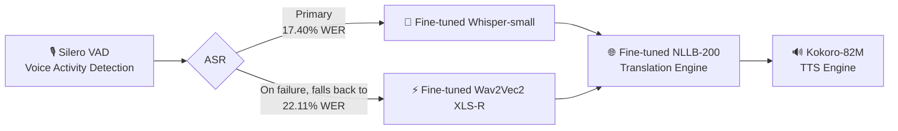

# 🏔️ Balti Tarjuman (بلتی ترجمان)

[](https://huggingface.co/YuvrajGujari/whisper-small-balti)
[](LICENSE)
[](https://www.python.org/)

An end-to-end Speech-to-Speech Translation (S2ST) system for **Balti (بلتی)**, a low-resource Tibetic language spoken by ~400,000 people across Gilgit-Baltistan and Baltistan, written in Perso-Arabic (Nastaliq) script.

Balti remains severely under-resourced in NLP and speech technology, with limited publicly available datasets, models, and language-specific tooling. **Balti Tarjuman** bridges this gap by deploying an integrated pipeline that translates spoken Balti into synthesized English speech — available both as a **batch pipeline** and as a **real-time streaming pipeline** (~2–3s round-trip latency from live microphone input).

---

## 🎥 Demo

**Upload a Balti audio file and hear the English translation:**


**Live, unscripted — speaking Balti into the mic:**


🎬 [Watch the full demo with audio (1:04)](https://github.com/user-attachments/assets/ffed7c0f-b8a0-4312-b6d5-eccdb7e58e85)

---

## 🏗️ System Architecture

The pipeline processes continuous audio through four sequential stages, with an automatic ASR fallback for robustness:



1. **Voice Activity Detection (VAD):** [Silero VAD](https://github.com/snakers4/silero-vad) isolates valid speech frames and trims silent segments.

2. **ASR (Whisper primary, Wav2Vec2 fallback):**

   * **Primary:** Fine-tuned [`openai/whisper-small`](https://huggingface.co/YuvrajGujari/whisper-small-balti) (**17.40% WER**) transcribes Balti speech into Perso-Arabic (Nastaliq) text.
   * **Fallback:** The pipeline falls back to a fine-tuned [`wav2vec2-xls-r-300m`](https://huggingface.co/YuvrajGujari/wav2vec2-balti-specaugment) CTC model (**22.11% WER**) in two cases: if Whisper raises an exception, or if Whisper's transcription exceeds a configurable latency bound (default 3s) — the latter runs Whisper in a worker thread and abandons waiting for it once the bound is hit, so a single slow inference can't stall the live pipeline. Both fallback paths are logged separately (`wav2vec2_fallback_error` vs `wav2vec2_fallback_timeout`) for debugging which failure mode is actually occurring in practice.

3. **Machine Translation (MT):** Fine-tuned [`facebook/nllb-200-distilled-600M`](https://huggingface.co/YuvrajGujari/nllb-balti-mt) translates Perso-Arabic Balti text into English.

4. **Text-to-Speech (TTS):** [Kokoro-82M](https://huggingface.co/hexgrad/Kokoro-82M) synthesizes English audio from the translated text.

---

### Pipeline Execution Modes

The pipeline runs in two modes sharing a single set of loaded models:

* **Batch Mode** (`pipeline.py`) — processes a complete `.wav` file via `BaltiTarjumanPipeline.run()`.
* **Streaming Mode** (`streaming_pipeline.py`) — continuous VAD-based segmentation of a live audio stream, built on Silero's `VADIterator` plus a threaded worker/queue design so capture, inference, and playback don't block one another. Reuses the batch pipeline's already-loaded models rather than duplicating them.

### Streaming Latency

The streaming pipeline achieves approximately **2–3 seconds of round-trip latency** from live microphone input, measured on a Kaggle T4 GPU via the Gradio interface. This is based on informal repeated testing across multiple utterances, not a controlled multi-run benchmark.

---

## 📊 Evaluation

All ASR experiments in this repository use the project's own held-out validation set and the same WER evaluation pipeline unless otherwise specified.

The BaltiVoice comparison below has **not been independently verified as an identical evaluation setup** (dataset split and methodology compatibility are unconfirmed) — it's included as an external reference point, not a directly controlled comparison.

For machine translation, BLEU is reported on the available Balti-English evaluation data.

---

## 🏆 ASR Results

Our fine-tuned Whisper-small model achieves the best WER observed in this project, improving substantially over the published BaltiVoice Whisper-small baseline of **26.74%**.

|   Rank   | Model Architecture            | Strategy                         |   Steps  | Validation WER |                                    Link                                    |
| :------: | :----------------------------- | :-------------------------------- | :------: | :-------------: | :--------------------------------------------------------------------------: |
| 🥇 **1** | **Whisper-small (Champion)**   | **Cold-Start + SpecAugment**      | **2500** |   **17.40%**    |     [HF Model](https://huggingface.co/YuvrajGujari/whisper-small-balti)     |
| 🥈 **2** | Wav2Vec2 XLS-R 300M            | SpecAugment + Tuned LR            |   7560   |   **22.11%**    | [HF Model](https://huggingface.co/YuvrajGujari/wav2vec2-balti-specaugment) |
| 🥉 **3** | *BaltiVoice Paper Baseline*    | Published Literature              |     —    |    *26.74%*     |                                      —                                      |
|     4    | Wav2Vec2 XLS-R 300M            | Cold-Start CTC (no augmentation)  |   7400   |   **22.82%**    |       [HF Model](https://huggingface.co/YuvrajGujari/wav2vec2-balti)       |
|     5    | Whisper-small (Warm-Start R2)  | Standard Fine-Tuning (`1e-5` LR)  |   1000   |   **36.38%**    |                                      —                                      |
|     6    | Whisper-small (Zero-Shot)      | Base Out-of-the-Box               |     0    |   **63.42%**    |                                      —                                      |

---

## 🌐 Machine Translation

The translation stage uses a fine-tuned **NLLB-200 distilled 600M** model adapted for Balti.

### Model

* **Base:** `facebook/nllb-200-distilled-600M`
* **Balti configuration:** `bft_Arab`
* **Training data:** 504 Balti-English parallel pairs from the available public Balti-English data used in this project
* **Evaluation metric:** BLEU
* **BLEU:** **4.88**

NLLB-200 did not natively support Balti, so the translation stage required model adaptation before fine-tuning: the project introduced the `bft_Arab` language token and initialized its embedding from a related existing language representation rather than random initialization.

---

## 🔗 Models & Datasets

| Component           | Repository Link                                                                                             | Description                                                             |
| :------------------- | :------------------------------------------------------------------------------------------------------------ | :-------------------------------------------------------------------------- |
| 🏆 **ASR Champion**  | [`YuvrajGujari/whisper-small-balti`](https://huggingface.co/YuvrajGujari/whisper-small-balti)               | Fine-tuned Whisper-small (**17.40% WER**)                                   |
| ⚡ **ASR Fallback**   | [`YuvrajGujari/wav2vec2-balti-specaugment`](https://huggingface.co/YuvrajGujari/wav2vec2-balti-specaugment) | Fine-tuned Wav2Vec2 XLS-R 300M, SpecAugment + tuned LR (**22.11% WER**)      |
| 🌐 **MT Model**      | [`YuvrajGujari/nllb-balti-mt`](https://huggingface.co/YuvrajGujari/nllb-balti-mt)                           | Fine-tuned NLLB-200 Distilled (**4.88 BLEU**)                               |
| 📂 **ASR Dataset**   | [`YuvrajGujari/balti-tarjuman-data`](https://huggingface.co/datasets/YuvrajGujari/balti-tarjuman-data)      | Cleaned Balti audio with Perso-Arabic text                                  |

---

## ⚡ Quick Start

### Installation

```bash
git clone https://github.com/YuvrajGujari/balti-tarjuman.git
cd balti-tarjuman
pip install -r requirements.txt
```

### End-to-End Speech Translation (Batch)

```python
from pipeline import BaltiTarjumanPipeline

pipeline = BaltiTarjumanPipeline()  # auto-selects CUDA if available

result = pipeline.run("path/to/balti_audio.wav")

print("Balti transcript:", result["balti_text"])
print("English translation:", result["english_text"])
print("Output audio written to:", result["audio_path"])
```

### Real-Time Streaming Translation

```python
from pipeline import BaltiTarjumanPipeline
from streaming_pipeline import StreamingBaltiTarjumanPipeline

pipeline = BaltiTarjumanPipeline()
streaming = StreamingBaltiTarjumanPipeline(pipeline)  # reuses pipeline's loaded models
streaming.start()

# Feed a complete wav file (or live mic frames via streaming.feed_audio_frame())
streaming.feed_wav_file("path/to/balti_audio.wav")

result = streaming.get_next_output(timeout=5)
if result:
    print("English translation:", result["english_text"])
```

### Live Demo (Gradio)

```bash
python gradio_streaming_demo.py
```

Launches a two-tab interface — live microphone streaming, and file
upload — both running through the real `StreamingBaltiTarjumanPipeline`.

### Testing the ASR Fallback

```bash
python scripts/test_asr_fallback.py
```

Pulls held-out clips from `YuvrajGujari/balti-tarjuman-data`, measures
Whisper's real latency distribution, and deliberately exercises both
the exception-based and timeout-based fallback paths to confirm they
actually route to and return valid output from the wav2vec2 backup —
not just that the code runs without error.

---

## 📖 Engineering Case Study

For a detailed account of the challenges solved along the way — dataset acquisition, adapting NLLB for an unsupported language, ASR fine-tuning strategy, and building the real-time streaming layer — see [`docs/Engineering Case Study.md`](docs/Engineering%20Case%20Study.md).

---

## 📄 License

Apache 2.0 — see [LICENSE](LICENSE) for details.
