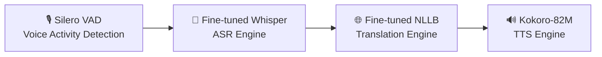

# 🏔️ Balti Tarjuman (بلتی ترجمان)

[](https://huggingface.co/YuvrajGujari/whisper-small-balti)
[](LICENSE)
[](https://www.python.org/)

An end-to-end Speech-to-Speech Translation (S2ST) system for **Balti (بلتی)**, a low-resource Tibetic language spoken by ~400,000 people across Gilgit-Baltistan and Baltistan, written in Perso-Arabic (Nastaliq) script.

Historically, Balti has had virtually no representation in natural language processing (NLP) or speech technology—lacking dedicated ASR baselines, translation engines, or coverage in major multilingual benchmarks. **Balti Tarjuman** bridges this gap by deploying an integrated pipeline that translates spoken Balti into synthesized English speech — available both as a **batch pipeline** and as a **real-time streaming pipeline** (~2–3s round-trip latency from live microphone input).

---

## 🎥 Demo

**Upload a Balti audio file and hear the English translation:**


**Live, unscripted — speaking Balti into the mic:**


🎬 [Watch the full demo with audio (1:04)](https://github.com/user-attachments/assets/ffed7c0f-b8a0-4312-b6d5-eccdb7e58e85)

---

## 🏗️ System Architecture

The pipeline processes continuous audio through four sequential stages:



1. **Voice Activity Detection (VAD):** [Silero VAD](https://github.com/snakers4/silero-vad) isolates valid speech frames and trims silent segments.
2. **Automatic Speech Recognition (ASR):** Fine-tuned [`openai/whisper-small`](https://huggingface.co/YuvrajGujari/whisper-small-balti) transcribes Balti audio into Perso-Arabic text.
3. **Machine Translation (MT):** Fine-tuned [`facebook/nllb-200-distilled-600M`](https://huggingface.co/YuvrajGujari/nllb-balti-mt) translates Balti text into English.
4. **Text-to-Speech (TTS):** [Kokoro-82M](https://huggingface.co/hexgrad/Kokoro-82M) synthesizes English translations into audio.

This same four-stage pipeline runs in two modes:

- **Batch** (`pipeline.py`) — translate a complete audio file via `BaltiTarjumanPipeline.run()`.
- **Streaming** (`streaming_pipeline.py`) — continuous VAD-based segmentation of a live audio stream, feeding each detected utterance through the same underlying pipeline in near real-time. Built on Silero's `VADIterator` plus a threaded worker/queue design so capture, inference, and playback don't block one another. The streaming layer reuses the batch pipeline's already-loaded models rather than duplicating them.
---

## 🏆 ASR Benchmark Leaderboard

By applying **Cold-Start re-initialization** and **SpecAugment regularization** (`mask_time_prob=0.05`, `mask_feature_prob=0.05`) with a high learning rate ($1\times 10^{-4}$), our fine-tuned Whisper model established a new state-of-the-art result for Balti ASR:

| Rank | Model Architecture | Strategy | Steps | Validation WER | Link |
| :---: | :--- | :--- | :---: | :---: | :---: |
| 🥇 **1** | **Whisper-small (Champion)** | **Cold-Start + SpecAugment** | **2500** | **17.40%** | [HF Model](https://huggingface.co/YuvrajGujari/whisper-small-balti) |
| 🥈 **2** | Wav2Vec2 XLS-R 300M | SpecAugment + Tuned LR | 7560 | **22.11%** | [HF Model](https://huggingface.co/YuvrajGujari/wav2vec2-balti-specaugment) |
| 🥉 **3** | *BaltiVoice Paper Baseline* | Published Literature | — | *26.74%* | — |
| 4 | Wav2Vec2 XLS-R 300M | Cold-Start CTC (no augmentation) | 7400 | **22.82%** | [HF Model](https://huggingface.co/YuvrajGujari/wav2vec2-balti) |
| 5 | Whisper-small (Warm-Start R2) | Standard Fine-Tuning (`1e-5` LR) | 1000 | **36.38%** | — |
| 6 | Whisper-small (Zero-Shot) | Base Out-of-the-Box | 0 | **63.42%** | — |

---

## 🔗 Models & Datasets

| Component | Repository Link | Description |
| :--- | :--- | :--- |
| 🏆 **ASR Champion** | [`YuvrajGujari/whisper-small-balti`](https://huggingface.co/YuvrajGujari/whisper-small-balti) | Fine-tuned Whisper-small (**17.40% WER**) |
| ⚡ **ASR Backup** | [`YuvrajGujari/wav2vec2-balti-specaugment`](https://huggingface.co/YuvrajGujari/wav2vec2-balti-specaugment) | Fine-tuned Wav2Vec2 XLS-R 300M, SpecAugment + tuned LR (**22.11% WER**) |
| 🌐 **MT Model** | [`YuvrajGujari/nllb-balti-mt`](https://huggingface.co/YuvrajGujari/nllb-balti-mt) | Fine-tuned NLLB-200 Distilled (**4.88 BLEU**) |
| 📂 **ASR Dataset** | [`YuvrajGujari/balti-tarjuman-data`](https://huggingface.co/datasets/YuvrajGujari/balti-tarjuman-data) | Cleaned Balti audio with Perso-Arabic text |

---

## ⚡ Quick Start

### Installation

```bash
git clone https://github.com/YuvrajGujari/balti-tarjuman.git
cd balti-tarjuman
pip install -r requirements.txt
```

### End-to-End Speech Translation (Batch)

```python
from pipeline import BaltiTarjumanPipeline

pipeline = BaltiTarjumanPipeline()  # auto-selects CUDA if available

result = pipeline.run("path/to/balti_audio.wav")

print("Balti transcript:", result["balti_text"])
print("English translation:", result["english_text"])
print("Output audio written to:", result["audio_path"])
```

### Real-Time Streaming Translation

```python
from pipeline import BaltiTarjumanPipeline
from streaming_pipeline import StreamingBaltiTarjumanPipeline

pipeline = BaltiTarjumanPipeline()
streaming = StreamingBaltiTarjumanPipeline(pipeline)  # reuses pipeline's loaded models
streaming.start()

# Feed a complete wav file (or live mic frames via streaming.feed_audio_frame())
streaming.feed_wav_file("path/to/balti_audio.wav")

result = streaming.get_next_output(timeout=5)
if result:
    print("English translation:", result["english_text"])
```

---

## 📖 Engineering Case Study

For a detailed account of the challenges solved along the way — dataset acquisition, adapting NLLB for an unsupported language, ASR fine-tuning strategy, and building the real-time streaming layer — see [`docs/Engineering Case Study.md`](docs/Engineering%20Case%20Study.md).

---

## 📄 License

Apache 2.0 — see [LICENSE](LICENSE) for details.
